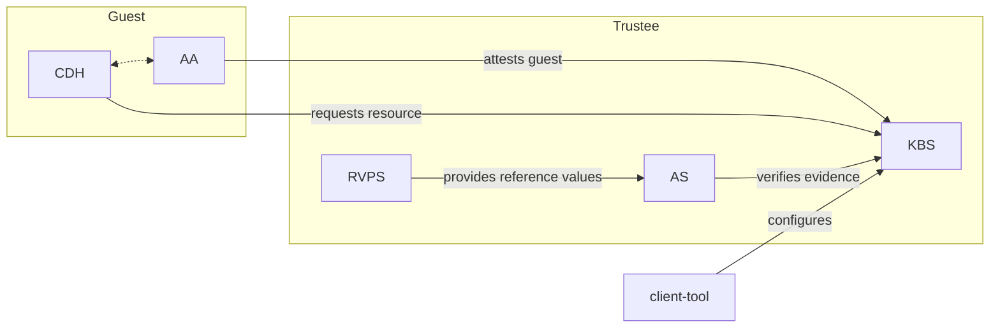
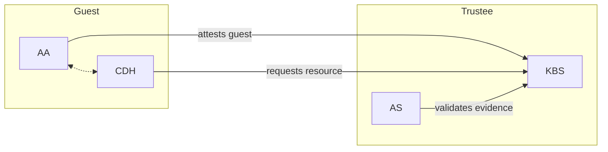
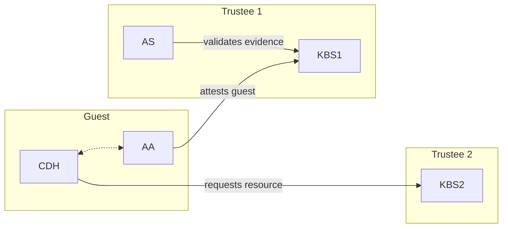

Trustee implements the [IETF RATS (Remote ATtestation procedureS) architecture](https://www.ietf.org/archive/id/draft-ietf-rats-architecture-22.html). Understanding the RATS roles and how the Trustee components fill them is the key to understanding how the system works.

## RATS roles

The RATS architecture defines three principal roles:

| RATS role | Trustee component | Responsibility |
|---|---|---|
| Relying Party | Key Broker Service (KBS) | Decides whether to release a secret based on attestation results |
| Verifier | Attestation Service (AS) | Verifies TEE evidence and produces an attestation result |
| Reference Value Provider | Reference Value Provider Service (RVPS) | Supplies expected software measurements for comparison |

The **Attester** is the confidential guest itself — the TEE running inside a VM or enclave. The attester is implemented by [guest-components](https://github.com/confidential-containers/guest-components), the counterpart to Trustee.

## Component overview



Inside the guest, two components work together:

- **Attestation Agent (AA)** — Generates hardware TEE evidence and performs the RCAR protocol with the KBS.
- **Confidential Data Hub (CDH)** — Requests secrets and keys from the KBS on behalf of applications.

On the Trustee side:

- **KBS** — Receives attestation and resource requests, coordinates with the AS, and delivers encrypted secrets.
- **AS** — Verifies TEE evidence forwarded by the KBS, consults RVPS for reference values, evaluates the result with an OPA policy, and returns a signed attestation token.
- **RVPS** — Stores and serves expected software measurements (reference values) over gRPC.

## The RCAR protocol

The KBS implements the **Request-Challenge-Attestation-Response (RCAR)** protocol over HTTP. This four-step handshake confirms that the guest is running in a trustworthy TEE before any secret is released.

<Steps>

<Step title="Request">

The guest sends an initial `Request` payload to `POST /kbs/v0/auth`. The payload declares the TEE platform type (e.g., `tdx`, `snp`, `sgx`) and the protocol version:

```json
{
  "version": "0.1.1",
  "tee": "tdx",
  "extra-params": {}
}
```

The KBS responds with a session cookie (`kbs-session-id`) and a `Challenge` payload containing a nonce.

</Step>

<Step title="Challenge">

The KBS returns a nonce that the guest must bind to its attestation evidence:

```json
{
  "nonce": "$nonce",
  "extra-params": {}
}
```

The nonce prevents replay attacks — stale evidence cannot be reused because the nonce will not match.

</Step>

<Step title="Attestation">

The guest generates a TEE key pair inside the hardware TEE. It then produces attestation evidence that cryptographically binds the nonce and the public key to the TEE measurement. This `Attestation` payload is sent to `POST /kbs/v0/attest`:

```json
{
  "runtime-data": {
    "nonce": "$nonce",
    "tee-pubkey": {
      "kty": "EC",
      "crv": "P-256",
      "alg": "ECDH-ES",
      "x": "$x_coordinate",
      "y": "$y_coordinate"
    }
  },
  "tee-evidence": {
    "primary_evidence": {},
    "additional_evidence": "{}"
  }
}
```

The KBS forwards the evidence to the AS for verification.

</Step>

<Step title="Response">

If attestation succeeds, the KBS returns a signed JWT attestation token. The guest can then request resources with either the session cookie or the token as a bearer credential.

Resources are returned encrypted with the TEE's public key using JWE (JSON Web Encryption), so only the TEE that produced the key pair can decrypt the response.

</Step>

</Steps>

<Note>
After a successful attestation, the session cookie allows the guest to request multiple resources without repeating the full RCAR handshake. The cookie is short-lived and scoped to a single KBS session.
</Note>

## Attestation modes

Trustee supports two attestation modes drawn from the RATS architecture.

<Tabs>
<Tab title="Background Check mode">

Background Check mode is the most common configuration. The KBS and AS are tightly coupled — the KBS is both the Relying Party and the entity that drives verification.



The guest attests to a single KBS. The KBS forwards evidence to the AS, receives the attestation result, and uses it to decide whether to release the requested resource.

This mode is appropriate when the same entity is responsible for both attestation and resource provisioning.

</Tab>
<Tab title="Passport mode">

Passport mode decouples attestation from resource delivery. Two separate KBS instances are used: one acts as the token issuer and one acts as the resource provider.



The guest first attests to **KBS1** (which works with an AS) to obtain a signed attestation token (the "passport"). It then presents that token to **KBS2** to retrieve resources. KBS2 trusts the token without needing its own AS.

This mode is appropriate when attestation and resource provisioning are managed by different organizations or services.

</Tab>
</Tabs>

See [Attestation modes](/kbs/attestation-modes) for usage examples of both modes.

## Internal component interactions

### KBS and AS integration

The KBS can integrate with the AS in two ways:

- **Builtin (in-process)** — The AS runs as a Rust crate compiled directly into the KBS binary. No network connection is required. This is the simplest deployment and is the default for the all-in-one binary.
- **gRPC (remote)** — The KBS connects to a separately deployed AS over gRPC. The AS listens on its gRPC interface (default port `50004`). This separation is useful when attestation and secret provisioning are in different trust boundaries.

### AS and RVPS integration

The AS connects to the RVPS over gRPC (default port `50003`) to retrieve reference values for a given software component. During evidence verification, the AS queries the RVPS for expected measurements and compares them against the values in the TEE evidence.

### Evidence verification flow

When the KBS receives an `Attestation` payload it:

1. Passes the TEE evidence and nonce to the AS.
2. The AS queries the RVPS for reference values.
3. The AS runs the TEE-specific verifier (e.g., the TDX or SNP verifier) to validate the hardware quote.
4. The AS evaluates the result against an OPA (Rego) policy.
5. The AS returns a signed JWT attestation token to the KBS.
6. The KBS checks the resource policy and, if approved, returns the resource encrypted with the TEE public key.

## Deployment topologies

<AccordionGroup>

<Accordion title="All-in-one binary">

The KBS, AS, and RVPS are compiled into a single binary. The AS runs as a builtin crate and the RVPS runs in-process. This is the simplest deployment for getting started or for development.

```bash
# Build KBS with builtin AS (background check mode)
make background-check-kbs
```

No gRPC connections between components are needed in this topology.

</Accordion>

<Accordion title="Docker Compose cluster">

The `docker-compose.yml` at the root of the repository defines a full cluster:

- `rvps` — RVPS gRPC server on port `50003`
- `as` — Attestation Service gRPC server on port `50004`
- `kbs` — Key Broker Service HTTP server on port `8080`
- `keyprovider` — Optional CoCo key provider on port `50000`
- `setup` — One-shot container that generates TLS and auth keys before the cluster starts

Services start in dependency order: `setup` → `rvps` → `as` → `kbs` → `keyprovider`.

See [Docker Compose deployment](/deployment/docker-compose) for the full setup guide.

</Accordion>

<Accordion title="Kubernetes">

Two options are available for Kubernetes:

- **KBS Operator** — The [kbs-operator](https://github.com/confidential-containers/kbs-operator) manages KBS component lifecycle as Kubernetes custom resources.
- **Kubernetes manifests** — Pre-built manifests are provided in `kbs/config/kubernetes/` for manual deployment.

See [Kubernetes deployment](/deployment/kubernetes) for details.

</Accordion>

</AccordionGroup>

## Security model

A few properties are fundamental to Trustee's security design:

- **Evidence is hardware-signed.** TEE evidence contains measurements signed by the hardware. The AS verifier validates the hardware signature chain before trusting any measurement value.
- **Nonces prevent replay.** The KBS issues a fresh nonce with each Challenge. The nonce must be bound to the TEE evidence, so an attacker cannot reuse old evidence.
- **Responses are TEE-encrypted.** Secret resources are encrypted with the TEE's ephemeral public key using JWE. Only the specific TEE instance that generated the key pair during attestation can decrypt the response.
- **Policy controls access.** OPA (Rego) policies on the AS determine which TEE measurements are acceptable, and resource policies on the KBS determine which attested TEEs can access which resources.

<Note>
HTTPS is required in production to authenticate the KBS to the client and to protect the RCAR exchange. The TEE's hardware-generated key provides an additional encryption layer on top of TLS. See [HTTPS/TLS](/kbs/https-tls) for setup instructions.
</Note>
