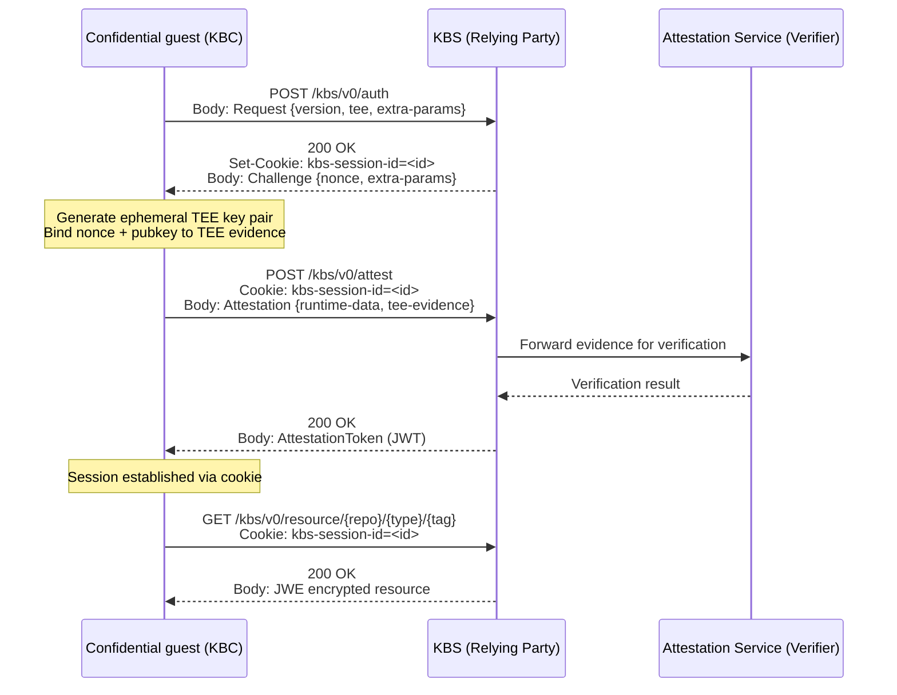
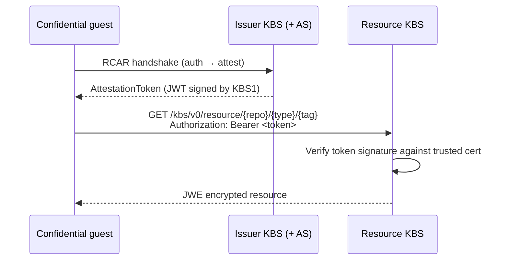

The KBS supports two interaction patterns drawn from the [RATS architecture](https://www.ietf.org/archive/id/draft-ietf-rats-architecture-22.html): **Background Check** mode and **Passport** mode. The mode you choose determines how attestation evidence is verified and how resources are provisioned.

<Tabs>
  <Tab title="Background Check mode">

## Background Check mode

[Background Check](https://www.ietf.org/archive/id/draft-ietf-rats-architecture-22.html#section-5.2) mode is the most common configuration. A single KBS instance orchestrates both attestation and resource delivery. The KBS receives evidence from the guest, passes it to the Attestation Service for verification, and returns the resource encrypted for the guest's hardware-generated key.

### When to use it

- Single-operator deployments where attestation and resource provisioning are managed together.
- Simpler deployments that do not require cross-organizational trust boundaries.
- The recommended starting point for most use cases.

### The RCAR protocol

The KBS uses the **Request-Challenge-Attestation-Response (RCAR)** protocol to perform attestation. The protocol is hardware- and vendor-agnostic and uses JSON payloads over HTTPS.



#### Step 1 — Request

The guest sends a `Request` payload to `/kbs/v0/auth` declaring its TEE type and the protocol version.

```json
{
  "version": "0.1.1",
  "tee": "tdx",
  "extra-params": {}
}
```

Supported `tee` values include `tdx`, `sgx`, `snp`, `cca`, `csv`, `se`, `tpm`, `az-snp-vtpm`, `az-tdx-vtpm`, and `sample` (for testing only).

#### Step 2 — Challenge

The KBS responds with a `Challenge` payload and sets a `kbs-session-id` cookie. The nonce prevents replay attacks.

```json
{
  "nonce": "a1b2c3d4e5f6...",
  "extra-params": {}
}
```

#### Step 3 — Attestation

The guest generates an ephemeral asymmetric key pair inside the TEE, binds the nonce and the public key to the hardware evidence, and sends an `Attestation` payload to `/kbs/v0/attest`.

```json
{
  "runtime-data": {
    "nonce": "a1b2c3d4e5f6...",
    "tee-pubkey": {
      "kty": "EC",
      "crv": "P-256",
      "alg": "ECDH-ES",
      "x": "...",
      "y": "..."
    }
  },
  "tee-evidence": {
    "primary_evidence": {},
    "additional_evidence": "{}"
  }
}
```

The KBS forwards the evidence to the configured Attestation Service. The KBS itself does not parse or validate the evidence.

#### Step 4 — Response

On successful verification the KBS returns a signed JWT attestation token. The guest can then request resources using the session cookie. Resources are returned encrypted in JWE format using the TEE public key submitted in step 3.

```json
{
  "token": "<JWT>"
}
```

### Cookie-based session management

After a successful attestation the `kbs-session-id` cookie remains valid for subsequent resource requests within the session window (default: 5 minutes). The guest does not need to repeat the RCAR handshake for every resource it requests during this period.

### Example configuration

```toml
[http_server]
sockets = ["0.0.0.0:8080"]
insecure_http = true

[admin]
type = "InsecureAllowAll"

[attestation_token]

[storage_backend]
storage_type = "LocalFs"

[storage_backend.backends.local_fs]
dir_path = "/opt/confidential-containers/storage"

[attestation_service]
type = "coco_as_builtin"

[attestation_service.attestation_token_broker]
duration_min = 5

[attestation_service.rvps_config]
type = "BuiltIn"

[[plugins]]
name = "resource"
type = "kvstorage"
```

  </Tab>
  <Tab title="Passport mode">

## Passport mode

[Passport](https://www.ietf.org/archive/id/draft-ietf-rats-architecture-22.html#section-5.1) mode decouples the validation of attestation evidence from the provisioning of resources. Two separate KBS instances are used: an **issuer KBS** that verifies evidence and issues attestation tokens, and a **resource KBS** that provisions resources to holders of valid tokens.

### When to use it

- Resource provisioning and attestation verification are handled by separate organizations or teams.
- The entity that owns the secret resources should not need to operate attestation infrastructure.
- Cross-organizational secret delivery where attestation trust is pre-established.

### Two-KBS setup



The guest first completes the RCAR handshake with the issuer KBS to obtain an attestation token. It then presents that token as a bearer credential to the resource KBS, which verifies the token signature and evaluates the resource policy before returning the encrypted resource.

<Note>
  The resource KBS does not connect to an Attestation Service. It only verifies the token signature using the trusted certificates or JWK sets you configure in `[attestation_token]`.
</Note>

### Build and start the issuer KBS

```bash
make passport-issuer-kbs
make install-issuer-kbs
issuer-kbs --socket 127.0.0.1:50001 --insecure-http --auth-public-key config/public.pub
```

### Build and start the resource KBS

```bash
make passport-resource-kbs
make install-resource-kbs
resource-kbs --socket 127.0.0.1:50002 --insecure-http --auth-public-key config/public.pub
```

### Obtain an attestation token

Generate a TEE key pair, then attest against the issuer KBS to receive a token:

```bash
openssl genrsa -traditional -out test/tee_key.pem 2048
openssl rsa -in test/tee_key.pem -pubout -out test/tee_pubkey.pem

kbs-client --url http://127.0.0.1:50001 attest --tee-key-file test/tee_key.pem > test/attestation_token
```

The public part of the TEE key is embedded in the token claims so the resource KBS can wrap the symmetric encryption key for the correct recipient.

### Retrieve a resource using the token

```bash
kbs-client --url http://127.0.0.1:50002 get-resource \
  --attestation-token test/attestation_token \
  --tee-key-file test/tee_key.pem \
  --path default/test/dummy
```

### Issuer KBS configuration

```toml
[http_server]
sockets = ["127.0.0.1:50001"]
insecure_http = true

[admin]
type = "InsecureAllowAll"

[attestation_service]
type = "coco_as_builtin"

[attestation_service.attestation_token_broker]
duration_min = 5
# Optional: pin a stable signing key so the resource KBS can trust it
# [attestation_service.attestation_token_broker.signer]
# key_path = "/path/to/token-key.pem"
# cert_path = "/path/to/token-cert-chain.pem"

[attestation_service.rvps_config]
type = "BuiltIn"

[storage_backend]
storage_type = "LocalFs"

[storage_backend.backends.local_fs]
dir_path = "./work/storage"

[[plugins]]
name = "resource"
type = "kvstorage"
```

### Resource KBS configuration

```toml
[http_server]
sockets = ["127.0.0.1:50002"]
insecure_http = true

[admin]
type = "InsecureAllowAll"

[[admin.personas]]
id = "admin"
public_key_path = "./work/kbs.pem"

[attestation_token]
# Provide the CA cert used to sign the issuer KBS token signing key
trusted_certs_paths = ["./work/ca-cert.pem"]
insecure_key = false

[storage_backend]
storage_type = "LocalFs"

[storage_backend.backends.local_fs]
dir_path = "./work/storage"

[[plugins]]
name = "resource"
type = "kvstorage"
```

<Warning>
  Set `insecure_key = false` in the resource KBS configuration and provide `trusted_certs_paths` pointing to the CA that signed the issuer KBS token key. Without this, the resource KBS cannot verify the trustworthiness of the token's embedded public key.
</Warning>

  </Tab>
</Tabs>
