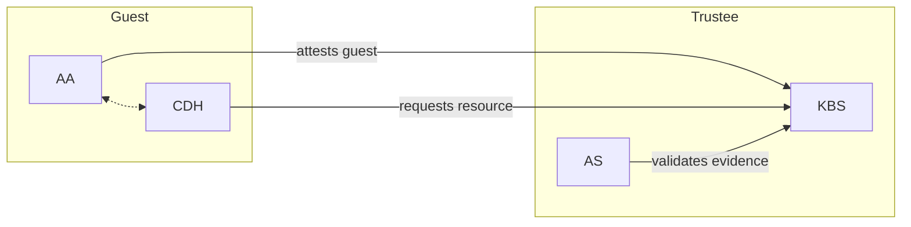
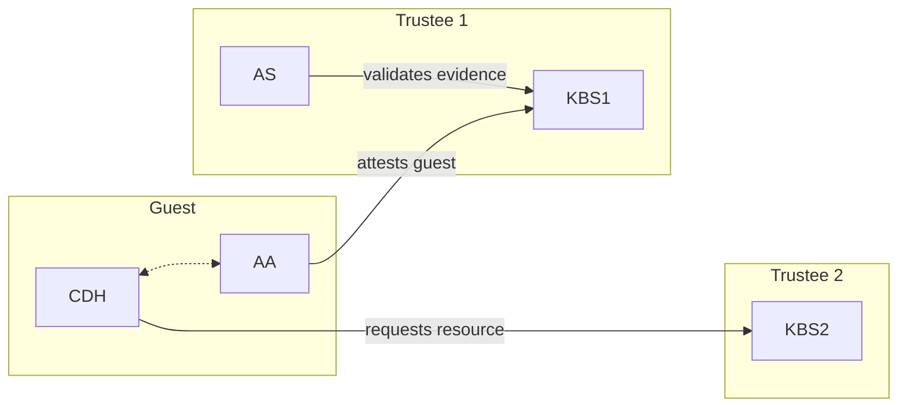

The Confidential Containers Key Broker Service (KBS) facilitates remote attestation-based identity authentication and authorization, secret resource storage and access control. It is an implementation of a [Relying Party](https://www.ietf.org/archive/id/draft-ietf-rats-architecture-22.html) in the IETF RATS architecture.

## Role in the RATS architecture

In the RATS model, a Relying Party is the entity that grants access to protected resources based on the trustworthiness of an attester. The KBS plays this role: it does not validate attestation evidence itself but instead delegates evidence verification to an external Attestation Service (AS) acting as the Verifier.

When a confidential guest requests a secret resource, the KBS:

1. Challenges the guest to produce attestation evidence.
2. Forwards the evidence to the configured AS for verification.
3. Returns the requested resource in encrypted form if the AS confirms the guest is trustworthy and the resource policy permits access.

This separation of concerns lets you deploy the verifier independently and swap attestation backends without changing how resources are stored or delivered.

## Supported attestation backends

<Tabs>
  <Tab title="CoCo Attestation Service (builtin)">
    The CoCo AS can be compiled directly into the KBS binary using the `coco-as-builtin` feature. This avoids the complexity of a remote connection and is the recommended approach for most deployments.

    The builtin AS supports all TEE verifier plug-ins, including TDX, SGX, SNP, CCA, CSV, IBM SE, TPM, and Azure vTPM variants.

    ```toml
    [attestation_service]
    type = "coco_as_builtin"
    ```
  </Tab>
  <Tab title="CoCo Attestation Service (gRPC)">
    The KBS can connect to a separately running CoCo AS over gRPC using the `coco-as-grpc` feature. This is useful when attestation verification and resource provisioning are handled by separate services or teams.

    ```toml
    [attestation_service]
    type = "coco_as_grpc"
    as_addr = "http://127.0.0.1:50004"
    ```
  </Tab>
  <Tab title="Intel Trust Authority">
    The KBS can be configured to use [Intel Trust Authority (ITA)](https://docs.trustauthority.intel.com) as the attestation backend using the `intel-trust-authority-as` feature. This option only supports Intel SGX and TDX.

    ```toml
    [attestation_service]
    type = "intel_ta"
    base_url = "https://api.trustauthority.intel.com"
    api_key = "tBfd5kKX2x9ahbodKV1..."
    certs_file = "https://portal.trustauthority.intel.com"
    ```
  </Tab>
</Tabs>

## Deployment topologies

The KBS supports two primary interaction patterns with the Attestation Service, defined by the RATS architecture.

### Background Check mode

Background Check mode is the most common configuration. The KBS acts as both the Relying Party and the attestation orchestrator. It receives evidence from the guest, passes it to the AS for verification, and then decides whether to release the requested resource.



In this topology the KBS is the Relying Party and the AS is the Verifier.

### Passport mode

Passport mode decouples resource provisioning from evidence verification. Two separate KBS instances are used: one that issues attestation tokens (backed by an AS) and one that provisions resources using those tokens.



KBS1 and the AS together act as the Verifier. KBS2 is the Relying Party that provisions resources using the attestation token issued by KBS1. This topology suits cases where resource provisioning and attestation are managed by separate organizations.

<Note>
  The KBS does not support direct connections from clients to the AS. KBS1 serves as the intermediary between the guest and the AS.
</Note>

## Related pages

<Columns cols={2}>
  <Card title="Attestation modes" icon="shield-check" href="/kbs/attestation-modes">
    Detailed guide to Background Check and Passport mode, including RCAR protocol flow and configuration examples.
  </Card>
  <Card title="Resource management" icon="database" href="/kbs/resource-management">
    How to upload, retrieve, and manage secret resources, including storage backends.
  </Card>
  <Card title="Policies" icon="file-check" href="/kbs/policies">
    Writing and uploading OPA/Rego policies that control which attestations may access which resources.
  </Card>
  <Card title="HTTPS and TLS" icon="lock" href="/kbs/https-tls">
    Configuring TLS for the KBS HTTP server, including self-signed certificates for testing.
  </Card>
</Columns>
