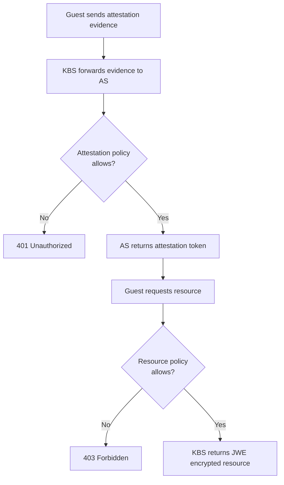

The KBS uses two distinct types of [Open Policy Agent (OPA)](https://www.openpolicyagent.org/) Rego policies:

- **Attestation policies** — evaluated by the Attestation Service to decide whether a guest's TEE evidence is acceptable.
- **Resource policies** — evaluated by the KBS to decide whether an attested guest may access a specific resource.

Both policy types are written in Rego and can be uploaded at runtime using `kbs-client`.

## Attestation policies

Attestation policies are evaluated by the Attestation Service against the claims extracted from the TEE evidence. They determine whether a guest is considered trustworthy.

### Policy input

The input to an attestation policy is the set of claims produced by the AS verifier. The structure depends on the TEE type. For example, a TDX policy might inspect `tcb_svn` and `mr_td` fields.

### Writing an attestation policy

```rego
package my_policy

import future.keywords.if

default allow = false

# Allowed reference values for TDX fields
reference_tdx_tcb_svn = ["03000500000000000000000000000000"]
reference_tdx_mr_td = ["abcd1234", "1234abcd", "a1b2c3d4"]

allow if {
    input["tdx.quote.body.tcb_svn"] == reference_tdx_tcb_svn[_]
    input["tdx.quote.body.mr_td"] == reference_tdx_mr_td[_]
}
```

The `allow` rule must evaluate to `true` for the attestation to succeed.

### Uploading an attestation policy

```bash
kbs-client --url http://127.0.0.1:8080 \
  config \
  --auth-private-key config/private.key \
  set-attestation-policy \
  --policy-file /path/to/policy.rego
```

The HTTP API endpoint accepts a base64-encoded policy:

```
POST /kbs/v0/attestation-policy
```

```json
{
  "policy_id": "default_cpu",
  "policy": "<Base64EncodedPolicy>"
}
```

Only authenticated users can set attestation policies. The KBS verifies the caller's identity using a private-key-signed JWT.

## Resource policies

Resource policies are evaluated by the KBS itself, after attestation succeeds. They control whether a specific attestation result grants access to a specific resource.

### Policy input

The resource policy receives both the attestation claims and structured information about the requested resource:

```
{
    "plugin": <plugin-name>,
    "resource-path": [<...>, <sections>, <END>],
    "query": {
        "key": "value",
        ...
    }
}
```

For the `resource` plugin specifically, `resource-path` is always a three-element slice: `[repository, type, tag]`.

The attestation claims are also available in `input.submods`, with the structure defined by the Attestation Service.

### Uploading a resource policy

```bash
kbs-client --url http://127.0.0.1:8080 \
  config \
  --auth-private-key config/private.key \
  set-resource-policy \
  --policy-file sample_policies/allow_all.rego
```

The HTTP API endpoint accepts a base64-encoded policy:

```
POST /kbs/v0/resource-policy
```

```json
{
  "policy": "<Base64EncodedPolicy>"
}
```

## Sample policies

The `kbs/sample_policies/` directory provides three example policies.

### `deny_all.rego` — default

The default policy denies all resource access. This is intentionally restrictive: a guest must use genuine TEE attestation evidence, and an appropriate policy must be explicitly configured before any resource can be released.

```rego
package policy

default allow = false
```

The file contains extensive inline documentation explaining the input data format and the policy evaluation model.

<Warning>
  The default policy denies all requests, including those from sample attesters. Do not use `allow_all.rego` in production; it disables all access control.
</Warning>

### `allow_all.rego` — for testing only

Releases resources unconditionally to any caller that identifies itself as using the `resource` plugin. Equivalent to disabling the policy engine.

```rego
package policy

default allow = false

plugin = data.plugin

allow if {
    plugin == "resource"
}
```

Use this policy during local development to test the end-to-end flow without genuine TEE hardware:

```bash
kbs-client --url http://127.0.0.1:8080 \
  config \
  --auth-private-key config/private.key \
  set-resource-policy \
  --policy-file sample_policies/allow_all.rego
```

### `affirming.rego` — EAR-based access control

Releases resources only when all attestation sub-modules in the EAR token have an `ear.status` of `affirming`. This is suitable for production deployments that use the CoCo AS and want to enforce a positive attestation verdict.

```rego
package policy
import rego.v1

default allow = false

allow if {
    not any_not_affirming
    count(input.submods) > 0
}

any_not_affirming if {
    some _, submod in input.submods
    submod["ear.status"] != "affirming"
}
```

## Policy evaluation flow

The diagram below shows how attestation and resource policies interact during a resource request in Background Check mode.



## Related pages

<Columns cols={2}>
  <Card title="Attestation Service policy engine" icon="scale" href="/attestation-service/policy-engine">
    How the Attestation Service evaluates attestation policies.
  </Card>
  <Card title="Resource management" icon="database" href="/kbs/resource-management">
    Uploading resources and managing storage backends.
  </Card>
</Columns>
